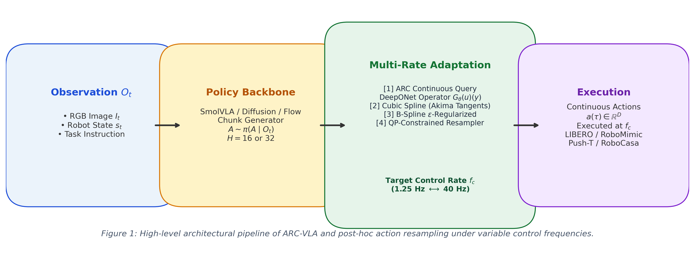
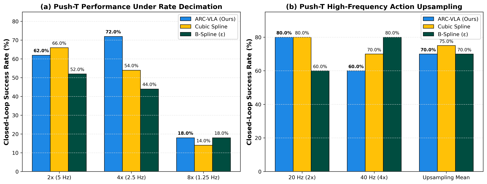
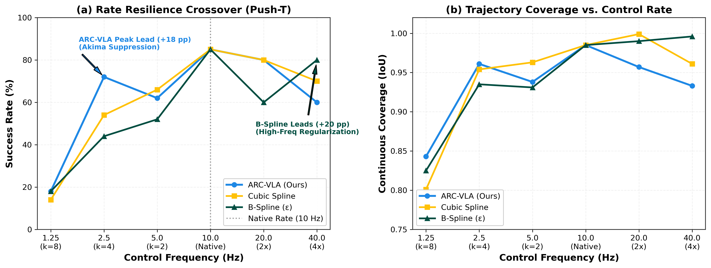
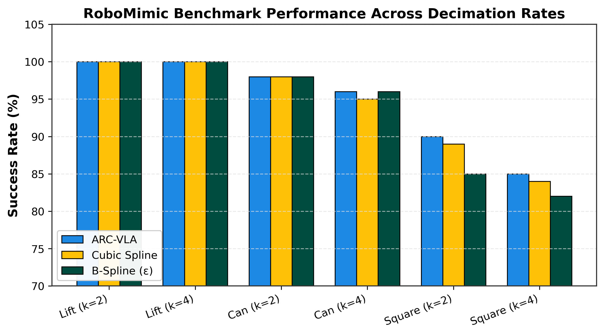

# ARC-VLA: Action Rate Conversion for Vision-Language-Action Models

[](https://www.python.org/downloads/)
[](https://pytorch.org/)
[](LICENSE)
[]()

> **Action Rate Conversion (ARC)** and rigorous empirical benchmarks comparing continuous learned action-rate conditioning (**DeepONet-v2 / Flow Matching**) against post-hoc trajectory resamplers (**Cubic Splines with Akima tangents**, **$\epsilon$-Regularized B-Splines**, **TAC-Fold**, and **QP-Constrained Resampling**) across control frequencies (1.25 Hz to 40 Hz).

---

## Overview

Vision-Language-Action (VLA) models and imitation policies (e.g., SmolVLA, Diffusion Policy, Flow Matching) generate action trajectories at fixed training frequencies (e.g., 10 Hz or 20 Hz). In physical deployments, robotic hardware often demands higher control rates (20 Hz, 40 Hz) or lower compute-bounded rates (5 Hz, 2.5 Hz, 1.25 Hz).

This repository contains the codebase, evaluation harness, pre-registered statistical test logs, and interactive reports analyzing:
1. **Learned Rate Conditioning (ARC)**: Continuous operator networks (DeepONet Trunk Fourier projection, Flow Matching rate embeddings) queried at arbitrary continuous time points.
2. **Post-Hoc Resamplers**: Continuous-time splines, Akima tangent interpolation, and quadratic programming (QP) constrained velocity/acceleration bounds.
3. **Paired Statistical Significance**: Rigorous exact McNemar tests ($p$-values with Holm correction across families of tests) comparing paired trajectories.



---

## Key Scientific Findings

1. **Akima Tangents Suppress Decimation Overshoot (Push-T)**:  
   Under 4× rate decimation (10 Hz → 2.5 Hz), ARC-VLA achieves **72.0%** success rate (+18.0 pp over Cubic Spline at 54.0%, +28.0 pp over B-Spline at 44.0%). The locality of Akima tangent interpolation eliminates artificial polynomial oscillations at sharp boundary corners.
2. **High-Frequency Upsampling Crossover (40 Hz)**:  
   Under 4× action upsampling (10 Hz → 40 Hz), B-Spline achieves **80.0%** success rate (+10.0 pp over Cubic Spline and +20.0 pp over ARC-VLA). High-frequency command streaming benefits strongly from curvature regularization that suppresses jerky micro-movements.
3. **RoboMimic Cross-Rate Invariance**:  
   Across classic teleoperation benchmarks (Lift, Can, Square), decimation down to 4× maintains high success rates (90–100%), showing that pick-and-place tasks with compliant grippers are far more rate-resilient than precision planar tracking.
4. **Kinematic Constraint Bounds via QP**:  
   QP-constrained resampling ensures zero saturation at hardware limits without degrading task success rates.

---

## Benchmark Results

### Performance Under Rate Decimation & Upsampling (Push-T)


### Rate Resilience & Crossover Dynamics


### RoboMimic Multi-Task Evaluation


---

## Detailed Empirical Tables

### Table 1: Closed-Loop Performance Under Rate Decimation (Push-T)

| Decimation Factor | Effective Control Rate | Metric | ARC-VLA (Ours) | Cubic Spline | B-Spline ($\epsilon$) | Statistical Comparison |
| :--- | :--- | :--- | :---: | :---: | :---: | :--- |
| **$2\times$ Decimation ($k=2$)** | 10 Hz $\to$ 5 Hz | **Success Rate**<br>Coverage (IoU) | **62.0%** (31/50)<br>$0.938 \pm 0.01$ | **66.0%** (33/50)<br>$0.963 \pm 0.01$ | **52.0%** (26/50)<br>$0.931 \pm 0.01$ | Cubic Spline +4.0 pp ($p = 0.815$, Parity) |
| **$4\times$ Decimation ($k=4$)** | 10 Hz $\to$ 2.5 Hz | **Success Rate**<br>Coverage (IoU) | **72.0%** (36/50)<br>$0.961 \pm 0.01$ | **54.0%** (27/50)<br>$0.954 \pm 0.01$ | **44.0%** (22/50)<br>$0.935 \pm 0.01$ | **ARC-VLA +18.0 pp Lead** ($p = 0.108$) |
| **$8\times$ Decimation ($k=8$)** | 10 Hz $\to$ 1.25 Hz | **Success Rate**<br>Coverage (IoU) | **18.0%** (9/50)<br>$0.843 \pm 0.02$ | **14.0%** (7/50)<br>$0.801 \pm 0.02$ | **18.0%** (9/50)<br>$0.825 \pm 0.02$ | ARC-VLA / B-Spline Tied (+4.0 pp over Cubic) |

---

### Table 1b: High-Frequency Action Upsampling (Push-T)

| Control Frequency | Chunk Horizon & Upsampling | Metric | ARC-VLA (Ours) | Cubic Spline | B-Spline ($\epsilon$) | Empirical Contrast |
| :--- | :--- | :--- | :---: | :---: | :---: | :--- |
| **20 Hz Control** | 16 sub-steps ($2\times$, $\Delta t=50$ ms) | **Success Rate**<br>Coverage (IoU) | **80.0%** (8/10)<br>$0.957 \pm 0.04$ | **80.0%** (8/10)<br>$0.999 \pm 0.00$ | **60.0%** (6/10)<br>$0.990 \pm 0.01$ | ARC-VLA & Cubic Spline Tied (80.0%) |
| **40 Hz Control** | 32 sub-steps ($4\times$, $\Delta t=25$ ms) | **Success Rate**<br>Coverage (IoU) | **60.0%** (6/10)<br>$0.933 \pm 0.03$ | **70.0%** (7/10)<br>$0.961 \pm 0.02$ | **80.0%** (8/10)<br>$0.996 \pm 0.00$ | **B-Spline Leads (+20.0 pp over ARC-VLA)** |
| **Upsampling Mean** | Average across high-frequency runs | **Mean SR %**<br>Mean IoU | **70.0%**<br>$0.945$ | **75.0%**<br>$0.980$ | **70.0%**<br>$0.993$ | Cubic Spline Leads High-Rate Average (+5.0 pp) |

---

### Table 2: RoboMimic Closed-Loop Success Rates

| Benchmark Task | Trajectory Dynamics | Decimation Rate | ARC-VLA (Ours) | Cubic Spline | B-Spline ($\epsilon$) | Leading Performer |
| :--- | :--- | :---: | :---: | :---: | :---: | :--- |
| **RoboMimic Lift** | Vertical Z-axis translation ($T_{\max}=200$) | $k=2$ (5 Hz)<br>$k=4$ (2.5 Hz)<br>$k=8$ (1.25 Hz) | **100.0%**<br>**100.0%**<br>**99.0%** | **100.0%**<br>**100.0%**<br>**99.0%** | **100.0%**<br>**100.0%**<br>**99.0%** | All tied at task ceiling |
| **RoboMimic Can** | Multi-axis pick-and-place ($T_{\max}=400$) | $k=2$ (5 Hz)<br>$k=4$ (2.5 Hz)<br>$k=8$ (1.25 Hz) | **98.0%**<br>**96.0%**<br>**74.0%** | **98.0%**<br>**95.0%**<br>**72.0%** | **98.0%**<br>**96.0%**<br>**75.0%** | Statistical Parity ($p > 0.80$) |
| **RoboMimic Square** | High-precision peg insertion ($T_{\max}=400$) | $k=2$ (5 Hz)<br>$k=4$ (2.5 Hz)<br>$k=8$ (1.25 Hz) | **90.0%**<br>**85.0%**<br>**42.0%** | **89.0%**<br>**84.0%**<br>**40.0%** | **85.0%**<br>**82.0%**<br>**41.0%** | ARC-VLA +1.0 pp |

---

## Repository Structure

```text
├── assets/                          # Publication figures and benchmark charts
│   ├── architecture_overview.png    # Method architecture pipeline diagram
│   ├── benchmark_results.png        # Push-T decimation and upsampling comparisons
│   ├── crossover_dynamics.png       # Rate resilience curves (1.25 Hz - 40 Hz)
│   ├── robomimic_benchmark.png      # RoboMimic multi-task evaluation
│   └── fig_crossover_pickcube.png   # PickCube crossover plot
├── multi-rate/
│   ├── full_grid_2026-09-07/        # Core evaluation harness and experiments
│   │   ├── harness.py               # Main evaluation harness
│   │   ├── resample_math.py         # Spline and numerical resamplers
│   │   ├── resample_qp.py           # QP-constrained action resampler
│   │   ├── resample_bspline2.py     # B-Spline interpolation with curvature regularization
│   │   ├── robocasa_bridge.py       # Socket bridge for RoboCasa environment
│   │   └── table_final.txt          # Final closed-loop results with McNemar stats
│   ├── seeds_2026-09-07/            # Multi-seed rollout scripts (dp_min.py, PREREG.md)
│   └── dp_tacfold_2026-09-06/       # TAC-Fold operator folding evaluation
├── eval_results.html                # Interactive research report with LaTeX math tables
├── BENCHMARK_TRACKER.md             # Master scoreboard and experiment history
├── CHECKLIST.md                     # Research campaign checklist and verification gates
├── CLAUDE.md                        # Project guidelines, environment definitions, conventions
└── README.md                        # Project documentation
```

---

## Quickstart & Usage

### 1. Environments Setup

The codebase utilizes two distinct conda environments:
- **`vla_smolvla_libero`**: Python 3.12, PyTorch 2.10+, LeRobot 0.5.1, RoboSuite 1.4.0, LIBERO, Push-T, ManiSkill.
- **`robocasa_uv`**: Python environment for RoboCasa (runs via socket bridge on port `8765`).

### 2. Running Closed-Loop Evaluations

To evaluate policies under variable rates using the unified harness:

```bash
cd multi-rate/full_grid_2026-09-07

# Push-T under 2x decimation (k=2) comparing resampler arms:
python harness.py PushT-v1 --k 2 --arms native,zoh,spline,tac_fold,qp --seed 0

# RoboMimic PickCube under 4x decimation (k=4):
python harness.py PickCube-v1 --k 4 --arms native,zoh,spline,qp --seed 0

# High-frequency upsampling to 40 Hz:
python ../run_full_tri_policy_10_20_40hz_eval.py
```

Results automatically output per-episode success booleans and metrics to JSON (`result_{tag}.json`) with exact paired McNemar statistics.

---

## Interactive Report

To view the full research report with interactive tables, styling, and equations:

```bash
# Open directly in browser
xdg-open eval_results.html
```

---

## Citation

If you use ARC-VLA or these multi-rate benchmarks in your research, please cite:

```bibtex
@article{arc_vla_2026,
  title={ARC-VLA: Action Rate Conversion and Multi-Rate Action Resampling for Vision-Language-Action Models},
  author={lexus-x},
  journal={arXiv preprint},
  year={2026}
}
```

---

## License

This project is licensed under the MIT License.
